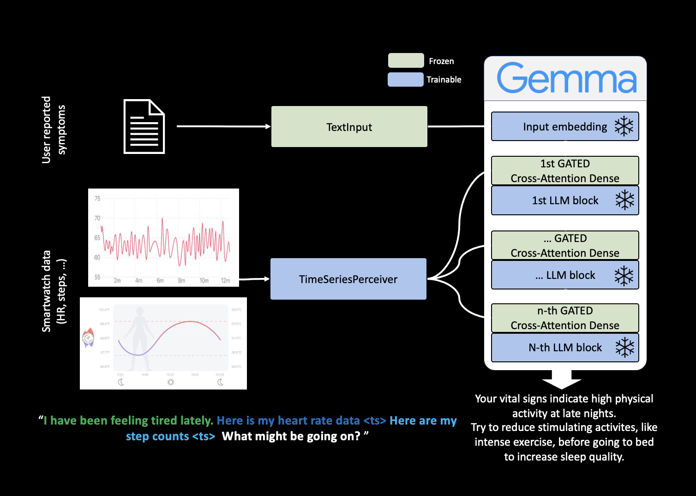

# VitalCue

<div align="center">
  
</div>

## Overview - WearableGemma

WearableGemma is an AI-powered platform for analyzing and captioning wearable sensor time series data using large language models. It leverages curriculum learning and advanced prompt engineering to generate meaningful insights from physiological signals.

<div align="center">
  
  <br>
  <em>Figure 1: System architecture of WearableGemma. Data flows from wearable sensors through preprocessing, model inference, and result visualization.</em>
</div>

---

## Preparation
First, install the EmbedHealth requirements:
```
pip install -r EmbedHealth/requirements.txt 
```

Then, install the WearableGemma requirements:
```
pip install -r requirements.txt 
```

---

## Training

To train WearableGemma, run:
```
python EmbedHealth/curriculum_learning.py --model EmbedHealthFlamingo --stages stage2_captioning --batch_size 8 --gradient_checkpointing --llm_id google/gemma-2b
```

---

## Hosting the API Server

You can host a FastAPI server for inference using `run.py`:

```
python run.py
```

By default, the server will be available at [http://localhost:8000](http://localhost:8000).

### API Endpoints

- **POST `/predict`**  
  Generate predictions from time series data.

  **Request JSON:**
  ```json
  {
    "pre_prompt": "Describe the patient's heart rate.",
    "time_series_text": ["Heart rate data"],
    "time_series_data": [[72, 75, 78, 80, 76, 74]],
    "post_prompt": "What does this indicate?",
    "max_new_tokens": 100
  }
  ```

  **Response JSON:**
  ```json
  {
    "generated_text": "The patient's heart rate shows a mild increase, possibly due to physical activity.",
    "input_info": {
      "pre_prompt": "...",
      "time_series_count": 1,
      "post_prompt": "...",
      "max_new_tokens": 100
    }
  }
  ```

- **GET `/health`**  
  Returns server and model health status.

- **GET `/model_info`**  
  Returns information about the loaded model.

---

## Usage Flow

```mermaid
graph TD
    A[Wearable Device] --> B[Data Preprocessing]
    B --> C[API Server (run.py)]
    C --> D[Model Inference]
    D --> E[Result Returned to User]
```

---

## Example Figure

<div align="center">
  
  <br>
  <em>Figure 2: Example of wearable sensor time series data processed by WearableGemma.</em>
</div>

---

## Citation

*Add your citation here if applicable.*

---

## License

See [LICENSE](LICENSE).

---

*For more details, see the documentation in `EmbedHealth/README.md`.*

